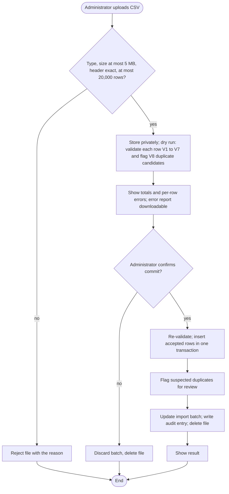

# Activity diagram: bulk CSV import

```mermaid
flowchart TD
    A([Administrator uploads CSV]) --> B{Type, size at most 5 MB, header exact, at most 20,000 rows?}
    B -- no --> X[Reject file with the reason] --> Z([End])
    B -- yes --> C[Store privately; dry run: validate each row V1 to V7 and flag V8 duplicate candidates]
    C --> D[Show totals and per-row errors; error report downloadable]
    D --> E{Administrator confirms commit?}
    E -- no --> Y[Discard batch, delete file] --> Z
    E -- yes --> F[Re-validate; insert accepted rows in one transaction]
    F --> G[Flag suspected duplicates for review]
    G --> H[Update import batch; write audit entry; delete file]
    H --> I[Show result] --> Z
```
