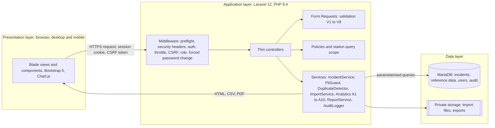

# Three-layer architecture

```mermaid
flowchart LR
    subgraph P[Presentation layer: browser, desktop and mobile]
        V[Blade views and components, Bootstrap 5, Chart.js]
    end
    subgraph A[Application layer: Laravel 12, PHP 8.4]
        MW[Middleware: preflight, security headers, auth, throttle, CSRF, role, forced password change]
        C[Thin controllers]
        FR[Form Requests: validation V1 to V8]
        PO[Policies and station query scope]
        S[Services: IncidentService, PiiGuard, DuplicateDetector, ImportService, Analytics A1 to A10, ReportService, AuditLogger]
    end
    subgraph D[Data layer]
        DB[(MariaDB: incidents, reference data, users, audit)]
        FS[[Private storage: import files, exports]]
    end
    V -->|HTTPS request, session cookie, CSRF token| MW --> C
    C --> FR
    C --> PO
    C --> S
    S -->|parameterised queries| DB
    S --> FS
    S -->|HTML, CSV, PDF| V
```
