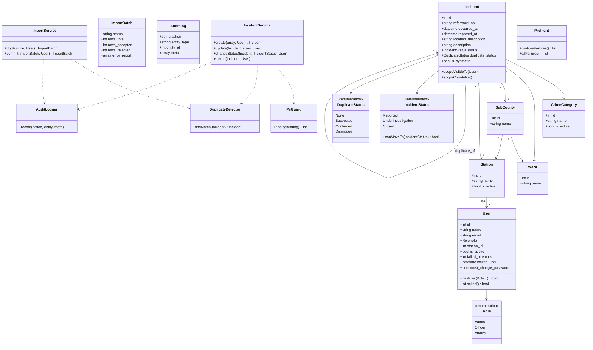

# Class diagram (domain and services)

```mermaid
classDiagram
    class User {
      +int id
      +string name
      +string email
      +Role role
      +int station_id
      +bool is_active
      +int failed_attempts
      +datetime locked_until
      +bool must_change_password
      +hasRole(Role...) bool
      +isLocked() bool
    }
    class Incident {
      +int id
      +string reference_no
      +datetime occurred_at
      +datetime reported_at
      +string location_description
      +string description
      +IncidentStatus status
      +DuplicateStatus duplicate_status
      +bool is_synthetic
      +scopeVisibleTo(User)
      +scopeCountable()
    }
    class SubCounty {
      +int id
      +string name
    }
    class Ward {
      +int id
      +string name
    }
    class Station {
      +int id
      +string name
      +bool is_active
    }
    class CrimeCategory {
      +int id
      +string name
      +bool is_active
    }
    class ImportBatch {
      +string status
      +int rows_total
      +int rows_accepted
      +int rows_rejected
      +array error_report
    }
    class AuditLog {
      +string action
      +string entity_type
      +int entity_id
      +array meta
    }
    class Role {
      <<enumeration>>
      Admin
      Officer
      Analyst
    }
    class IncidentStatus {
      <<enumeration>>
      Reported
      UnderInvestigation
      Closed
      +canMoveTo(IncidentStatus) bool
    }
    class DuplicateStatus {
      <<enumeration>>
      None
      Suspected
      Confirmed
      Dismissed
    }
    class IncidentService {
      +create(array, User) Incident
      +update(Incident, array, User)
      +changeStatus(Incident, IncidentStatus, User)
      +delete(Incident, User)
    }
    class PiiGuard {
      +findings(string) list
    }
    class DuplicateDetector {
      +findMatch(Incident) Incident
    }
    class ImportService {
      +dryRun(file, User) ImportBatch
      +commit(ImportBatch, User) ImportBatch
    }
    class AuditLogger {
      +record(action, entity, meta)
    }
    class Preflight {
      +runtimeFailures() list
      +allFailures() list
    }

    SubCounty "1" --> "*" Ward
    SubCounty "1" --> "*" Station
    Station "0..1" --> "*" User
    Incident "*" --> "1" CrimeCategory
    Incident "*" --> "1" Ward
    Incident "*" --> "1" SubCounty
    Incident "*" --> "1" Station
    Incident "*" --> "0..1" Incident : duplicate_of
    User --> Role
    Incident --> IncidentStatus
    Incident --> DuplicateStatus
    IncidentService ..> PiiGuard
    IncidentService ..> DuplicateDetector
    IncidentService ..> AuditLogger
    ImportService ..> DuplicateDetector
    ImportService ..> AuditLogger
```
