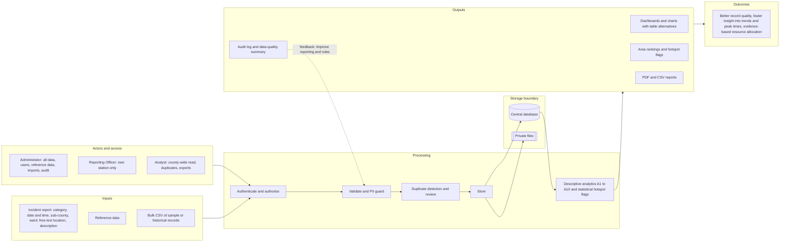

# Conceptual framework (Figure 2.1 redraw, no GIS)

```mermaid
flowchart LR
    subgraph ACT[Actors and access]
        A1[Administrator: all data, users, reference data, imports, audit]
        A2[Reporting Officer: own station only]
        A3[Analyst: county-wide read, duplicates, exports]
    end
    subgraph IN[Inputs]
        I1[Incident report: category, date and time, sub-county, ward, free-text location, description]
        I2[Reference data]
        I3[Bulk CSV of sample or historical records]
    end
    subgraph PR[Processing]
        P1[Authenticate and authorise]
        P2[Validate and PII guard]
        P3[Duplicate detection and review]
        P4[Store]
        P5[Descriptive analytics A1 to A10 and statistical hotspot flags]
    end
    subgraph ST[Storage boundary]
        DB[(Central database)]
        FS[[Private files]]
    end
    subgraph OUT[Outputs]
        O1[Dashboards and charts with table alternatives]
        O2[Area rankings and hotspot flags]
        O3[PDF and CSV reports]
        O4[Audit log and data-quality summary]
    end
    subgraph OC[Outcomes]
        R1[Better record quality, faster insight into trends and peak times, evidence-based resource allocation]
    end
    ACT --> P1
    IN --> P1 --> P2 --> P3 --> P4 --> DB
    DB --> P5 --> OUT --> OC
    P4 --> FS
    O4 -.->|feedback: improve reporting and rules| P2
```

Removed from the submitted Figure 2.1: GPS coordinates, hotspot boundaries, crime maps, spatial analysis.
