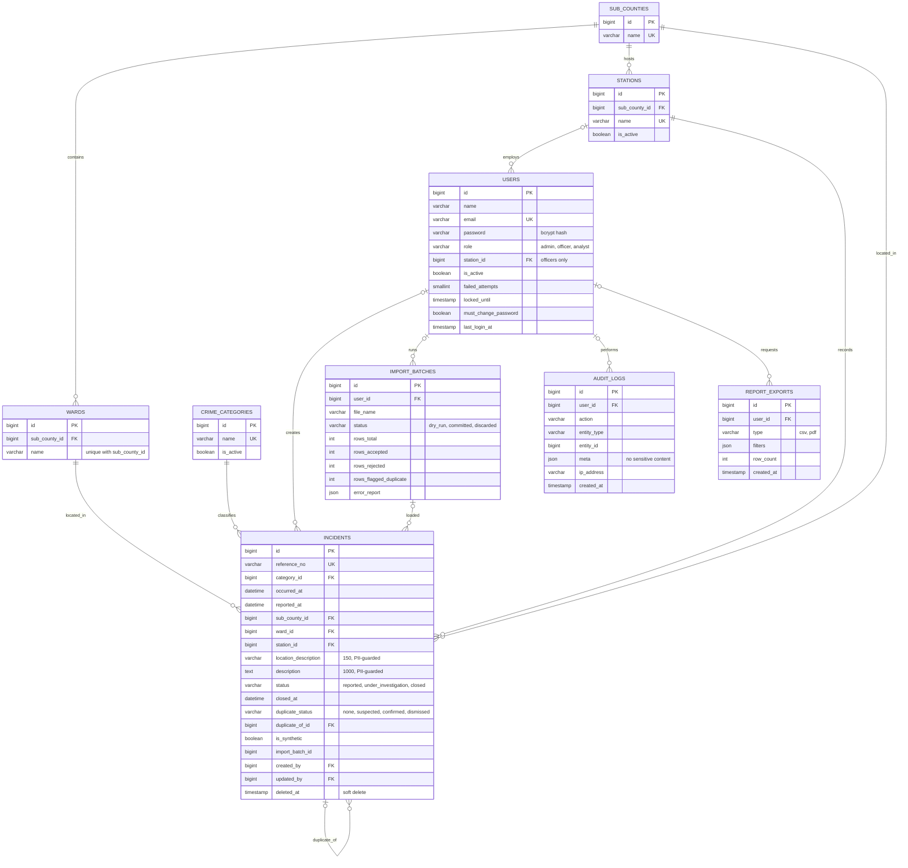

# Entity relationship diagram

Derived from `database/migrations`. No coordinate or spatial column exists (D-02).

```mermaid
erDiagram
    SUB_COUNTIES ||--o{ WARDS : contains
    SUB_COUNTIES ||--o{ STATIONS : hosts
    STATIONS |o--o{ USERS : employs
    CRIME_CATEGORIES ||--o{ INCIDENTS : classifies
    SUB_COUNTIES ||--o{ INCIDENTS : located_in
    WARDS ||--o{ INCIDENTS : located_in
    STATIONS ||--o{ INCIDENTS : records
    USERS |o--o{ INCIDENTS : creates
    INCIDENTS |o--o{ INCIDENTS : duplicate_of
    USERS |o--o{ IMPORT_BATCHES : runs
    IMPORT_BATCHES |o--o{ INCIDENTS : loaded
    USERS |o--o{ AUDIT_LOGS : performs
    USERS |o--o{ REPORT_EXPORTS : requests

    SUB_COUNTIES {
        bigint id PK
        varchar name UK
    }
    WARDS {
        bigint id PK
        bigint sub_county_id FK
        varchar name "unique with sub_county_id"
    }
    STATIONS {
        bigint id PK
        bigint sub_county_id FK
        varchar name UK
        boolean is_active
    }
    CRIME_CATEGORIES {
        bigint id PK
        varchar name UK
        boolean is_active
    }
    USERS {
        bigint id PK
        varchar name
        varchar email UK
        varchar password "bcrypt hash"
        varchar role "admin, officer, analyst"
        bigint station_id FK "officers only"
        boolean is_active
        smallint failed_attempts
        timestamp locked_until
        boolean must_change_password
        timestamp last_login_at
    }
    INCIDENTS {
        bigint id PK
        varchar reference_no UK
        bigint category_id FK
        datetime occurred_at
        datetime reported_at
        bigint sub_county_id FK
        bigint ward_id FK
        bigint station_id FK
        varchar location_description "150, PII-guarded"
        text description "1000, PII-guarded"
        varchar status "reported, under_investigation, closed"
        datetime closed_at
        varchar duplicate_status "none, suspected, confirmed, dismissed"
        bigint duplicate_of_id FK
        boolean is_synthetic
        bigint import_batch_id
        bigint created_by FK
        bigint updated_by FK
        timestamp deleted_at "soft delete"
    }
    IMPORT_BATCHES {
        bigint id PK
        bigint user_id FK
        varchar file_name
        varchar status "dry_run, committed, discarded"
        int rows_total
        int rows_accepted
        int rows_rejected
        int rows_flagged_duplicate
        json error_report
    }
    AUDIT_LOGS {
        bigint id PK
        bigint user_id FK
        varchar action
        varchar entity_type
        bigint entity_id
        json meta "no sensitive content"
        varchar ip_address
        timestamp created_at
    }
    REPORT_EXPORTS {
        bigint id PK
        bigint user_id FK
        varchar type "csv, pdf"
        json filters
        int row_count
        timestamp created_at
    }
```
