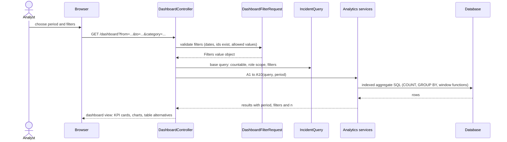

# Sequence diagram: analytics request

```mermaid
sequenceDiagram
    actor A as Analyst
    participant W as Browser
    participant C as DashboardController
    participant F as DashboardFilterRequest
    participant Q as IncidentQuery
    participant S as Analytics services
    participant D as Database
    A->>W: choose period and filters
    W->>C: GET /dashboard?from=...&to=...&category=...
    C->>F: validate filters (dates, ids exist, allowed values)
    F-->>C: Filters value object
    C->>Q: base query: countable, role scope, filters
    C->>S: A1 to A10(query, period)
    S->>D: indexed aggregate SQL (COUNT, GROUP BY, window functions)
    D-->>S: rows
    S-->>C: results with period, filters and n
    C-->>W: dashboard view: KPI cards, charts, table alternatives
```
