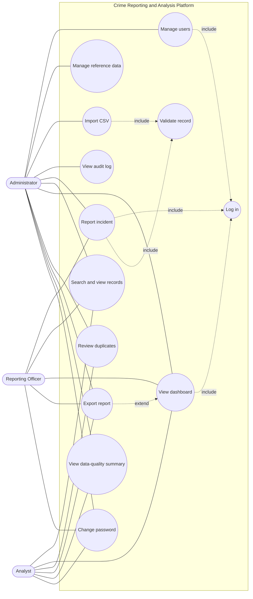

# Use case diagram

```mermaid
flowchart LR
    ADM([Administrator])
    OFF([Reporting Officer])
    ANA([Analyst])
    subgraph SYS[Crime Reporting and Analysis Platform]
        UC0((Log in))
        UC1((Manage users))
        UC2((Manage reference data))
        UC3((Import CSV))
        UC4((View audit log))
        UC5((Report incident))
        UC6((Search and view records))
        UC7((View dashboard))
        UC8((Review duplicates))
        UC9((Export report))
        UC10((Validate record))
        UC11((View data-quality summary))
        UC12((Change password))
    end
    ADM --- UC1 & UC2 & UC3 & UC4 & UC5 & UC6 & UC7 & UC8 & UC9 & UC11
    OFF --- UC5 & UC6 & UC7 & UC9
    ANA --- UC6 & UC7 & UC8 & UC9 & UC11
    ADM & OFF & ANA --- UC12
    UC1 -.->|include| UC0
    UC5 -.->|include| UC0
    UC7 -.->|include| UC0
    UC5 -.->|include| UC10
    UC3 -.->|include| UC10
    UC9 -.->|extend| UC7
```

Officer use cases are limited to the officer's own station.
